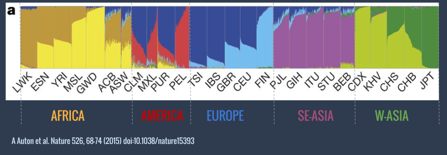

------------
> #### Learning Objectives
------------

### Outline:

[Assessment of population structure using ADMIXTURE](#main)

1. [The biological question](#sec1)

2. [The software required](#sec2)

      -[From raw data to variants](#sec2.1)

      -[Task specific](#sec2.2)

3. [Project tasks](#sec3)

  -[Download the fastq files](#sec3.1)

  -[Process the NGS data ](#sec3.2)

  -[Prepare input files for ADMIXTURE](#sec3.3)

  -[Run ADMIXTURE](#sec3.4)

  -[Interpret the output and prepare a report](#sec3.5)

4. [Recap](#sec4)

5. [References](#sec5)

__________________________________________________________

############################################

# Assessment of population structure using ADMIXTURE

############################################

## The biological question
We want to run a  study that requires a genetically homogeneous sample of individuals. We want to use available data form a prior study that collected DNA samples and produced whole genome sequences of sixty individuals. However we do not know anything about the origin of the sample and therefore we want to check if they represent an homogeneous sample or not.

############################################

## The software required

############################

### From raw data to variants

As the course will cover in very detail this part we will skip and talk only about more specific software.
In summary you will have to follow the pipeline we have applied during the practicals.

############################

### Task specific

#### ADMIXTURE

We will use an algorithm that analyses the data making an hypothesis about the number of possible clusters and try to fit individuals into them. This algorithm is implemented in a software called [ADMIXTURE](https://www.genetics.ucla.edu/software/admixture/), a program for estimating ancestry in a model-based manner from large autosomal SNP genotype datasets, where the individuals are unrelated.

 Take some time to read the [ADMIXTURE manual](https://www.genetics.ucla.edu/software/admixture/admixture-manual.pdf)

ADMIXTURE produces outputs like this:

>

>This plot is form the [1000 Genomes Nature's paper](http://www.nature.com/nature/journal/v526/n7571/full/nature15393.html). Every vertical line correspond to one individual and colors represent subdivisions in clusters according to genetic similarities. Each individual is colored with  one or more colors according to the likelihood of belonging to one or more clusters.

>Three-letters codes indicate population within continents. In some populations (e.g. JPT) individuals are very genetically similar and only one color is observed. In others (e.g. PUR) individuals belong to several clusters, some of which (e.g. dark blue) shared among different populations. This indicate admixture between these popuations.

When the program is run it ignores the geographical origin of individuals and this information is added only later in plotting the results.
This particular plot shows the case of the hypothesis of 8 clusters, represented here by 8 different colors.

############################################

## Project tasks

The NGS tasks are not described in detail in order to stimulate the discussion in the group in the pipeline to apply. You will have to decide which aligner, variant caller and filters are best for this project and explain why.
1. Download the fastq files

############################

### 1. Copy the fastq files in your directory

The Fastq files we will use here are publicly available at the [1000 Genomes ftp site](ftp://ftp.1000genomes.ebi.ac.uk/vol1/ftp/phase3/data/).

A selected subset of `.fastq` files are in this folder:  `/pico/scratch/userexternal/vcolonna/project_1/fastq`

Copy in your personal data directory the ones you will work with  using the shell  `cp` command

############################

### 2. Process the NGS data
You will align the reads to the reference genome, refine the BAM and make QC, do the variant calling and filtering.
