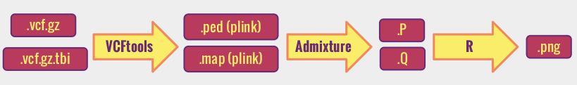

------------
> #### Learning Objectives
------------


### Outline: 

[Assessment of population structure using ADMIXTURE](#main)

1. [The biological question](#sec1)

2. [The software required](#sec2) 

      -[From raw data to variants](#sec2.1)

      -[Task specific](#sec2.2) 

      -[Pipeline](#sec2.3)

3. [Project tasks](#sec3)

  -[Download the fastq files](#sec3.1)

  -[altro](#sec3.2)

  -[Prepare input files for ADMIXTURE](#sec3.4)

  -[Run ADMIXTURE](#sec3.4)

  -[Interpret the output and prepare a report](#sec3.5)

4. [References](#sec4)

__________________________________________________________

############################################

<div id='main'/>
# Assessment of population structure using ADMIXTURE


############################################
<div id='sec1'/>
## The biological question
We want to run a  study that requires a genetically homogeneous sample of individuals. We want to use available data form a prior study that collected DNA samples and produced whole genome sequences of sixty individuals. However we do not know anything about the origin of the sample and therefore we want to check if they represent an homogeneous sample or not.


############################################
<div id='sec2'/>
## The software required


############################
<div id='sec2.1'/>

### From raw data to variants

As the course will cover in very detail this part we will skip and talk only about more specific software.

However .... ?????


############################
<div id='sec2.2'/>
### Task specific

#### ADMIXTURE

We will use an algorithm that analyses the data making an hypothesis about the number of possible clusters and try to fit individuals into them. This algorithm is implemented in a software called [ADMIXTURE](https://www.genetics.ucla.edu/software/admixture/), a program for estimating ancestry in a model-based manner from large autosomal SNP genotype datasets, where the individuals are unrelated.

 Take some time to read the [ADMIXTURE manual](https://www.genetics.ucla.edu/software/admixture/admixture-manual.pdf)

ADMIXTURE produces outputs like this:

>

>This plot is form the [1000 Genomes Nature's paper](http://www.nature.com/nature/journal/v526/n7571/full/nature15393.html). Every vertical line correspond to one individual and colors represent subdivisions in clusters according to genetic similarities. Each individual is colored with  one or more colors according to the likelihood of belonging to one or more clusters.

>Three letter codes indicate population within continents. In some populations (e.g. JPT) individuals are very genetically similar and only one color is observed. In others (e.g. PUR) individuals belong to several clusters, some of which (e.g. dark blue) shared among different populations. This indicate admixture between these popuations.


When the program is run it ignores the geographical origin of individuals and this information is added only later in plotting the results.
This particular plot shows the case of the hypothesis of 8 clusters, represented here by 8 different colors.


############################
<div id='sec2.3'/>
### Pipeline

ADMIXTURE has three options for **input**

1.  
ordinary [PLINK .ped]( <http://pngu.mgh.harvard.edu/~purcell/plink/data.shtml#ped>) and  [PLINK .map](http://pngu.mgh.harvard.edu/~purcell/plink/data.shtml#map) style files. Both must be all in the same directory.

2. binary [PLINK .bed](http://pngu.mgh.harvard.edu/~purcell/plink/data.shtml#bed) and associated files  [.bim (binary marker information)](http://pngu.mgh.harvard.edu/~purcell/plink/data.shtml#bed) and [.fam (pedigree)](http://pngu.mgh.harvard.edu/~purcell/plink/data.shtml#bed) all in the same directory.

3. [EIGENSTRAT .geno](https://github.com/DReichLab/EIG) and PLINK style [.map](http://pngu.mgh.harvard.edu/~purcell/plink/data.shtml#map) all in the same directory.

It is very common that a software uses the format of other software. In this case ADMIXTURE uses the format of the input files of two well known software for genetics analyses: [PLINK](http://pngu.mgh.harvard.edu/~purcell/plink/) and [EIGENSTRAT](https://github.com/DReichLab/EIG). Take some time to familiarize with these input file format.

_____

To generate the input file we  will use a feature of [VCFtools](https://vcftools.github.io/index.html) that convert `.vcf` files in PLINK (or EIGENSTRAT) format.  

_____
ADMIXTURE will output two types of files

___

To summarize, all the task-specific software we need to familiarize with is:  
  - ADMIXTURE
  - PLINK
  - EIGENSTRAT
  - VCFtools

We will run two of these softwares, and use only file format from others:

  


The software output


############################################
<div id='sec3'/>
## Project tasks

############################
<div id='sec3.1'/>
### 1. Download the fastq files

############################
<div id='sec3.2'/>
### 2. altro???


############################
<div id='sec3.3'/>
### 3. Prepare input files for ADMIXTURE

Now that we have the `.vcf.gz` file we will use the `--plink` option of VCFtools to convert `.vcf.gz` in `.ped` and `.map`
files:  

```
vcftools --gzvcf /home/colonna/ONGOING/CORSOROMA/data/ALL.chr22.phase3_shapeit2_mvncall_integrated_v5a.20130502.genotypes.vcf.gz  --plink --out /home/colonna/ONGOING/CORSOROMA/data/my60
```
> `--gzvcf`  *specifies the vcf file path*

> `--plink`  *indicates that we want to generate PLINK style files*

> `--out`  *specifies the path and names (prefix) of the output files*


This command line will create three output files:
- `.log` contains all the information of the
- `.map`
- `.ped`
 


############################
<div id='sec3.4'/>
#####  Submit a job to job scheduler  

If we are using a very small file, the command line described above can be very fast with and run interactively. However in reality files are large and we might want to submit jobs instead.

If we are using a machine with a [PBS](https://en.wikipedia.org/wiki/Portable_Batch_System) job scheduler we might want to embed the command line in a PBS script as described in the [instructions](00-beforewestart.md) to run jobs with PBS.

############################
<div id='sec3.5'/>
### 4. Run ADMIXTURE

############################
<div id='sec3.6'/>
### 5. Interpret the output and prepare a report


############################################
<div id='sec4'/>
## References
D.H. Alexander, J. Novembre, and K. Lange. Fast model-based estimation of
ancestry in unrelated individuals. Genome Research, 19:1655–1664, 2009.

Anil Raj, Matthew Stephens, and Jonathan K. Pritchard. fastSTRUCTURE:
Variational Inference of Population Structure in Large SNP Data Sets ,
(Genetics) June 2014 197:573-589
