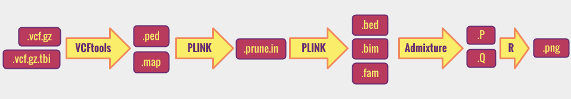

------------
> #### Learning Objectives
------------


### Outline:

[Assessment of population structure using ADMIXTURE](#main)

1. [The biological question](#sec1)

2. [The software required](#sec2)

      -[From raw data to variants](#sec2.1)

      -[Task specific](#sec2.2)

3. [Project tasks](#sec3)

  -[Download the fastq files](#sec3.1)

  -[Process the NGS data ](#sec3.2)

  -[Prepare input files for ADMIXTURE](#sec3.3)

  -[Run ADMIXTURE](#sec3.4)

  -[Interpret the output and prepare a report](#sec3.5)

4. [Recap](#sec4)

5. [References](#sec5)

__________________________________________________________

############################################

<div id='main'/>
# Assessment of population structure using ADMIXTURE


############################################
<div id='sec1'/>
## The biological question
We want to run a  study that requires a genetically homogeneous sample of individuals. We want to use available data form a prior study that collected DNA samples and produced whole genome sequences of sixty individuals. However we do not know anything about the origin of the sample and therefore we want to check if they represent an homogeneous sample or not.


############################################
<div id='sec2'/>
## The software required


############################
<div id='sec2.1'/>

### From raw data to variants

As the course will cover in very detail this part we will skip and talk only about more specific software.
In summary you will have to follow the pipeline we have applied during the practicals.


############################
<div id='sec2.2'/>
### Task specific

#### ADMIXTURE

We will use an algorithm that analyses the data making an hypothesis about the number of possible clusters and try to fit individuals into them. This algorithm is implemented in a software called [ADMIXTURE](https://www.genetics.ucla.edu/software/admixture/), a program for estimating ancestry in a model-based manner from large autosomal SNP genotype datasets, where the individuals are unrelated.

 Take some time to read the [ADMIXTURE manual](https://www.genetics.ucla.edu/software/admixture/admixture-manual.pdf)

ADMIXTURE produces outputs like this:

>

>This plot is form the [1000 Genomes Nature's paper](http://www.nature.com/nature/journal/v526/n7571/full/nature15393.html). Every vertical line correspond to one individual and colors represent subdivisions in clusters according to genetic similarities. Each individual is colored with  one or more colors according to the likelihood of belonging to one or more clusters.

>Three-letters codes indicate population within continents. In some populations (e.g. JPT) individuals are very genetically similar and only one color is observed. In others (e.g. PUR) individuals belong to several clusters, some of which (e.g. dark blue) shared among different populations. This indicate admixture between these popuations.


When the program is run it ignores the geographical origin of individuals and this information is added only later in plotting the results.
This particular plot shows the case of the hypothesis of 8 clusters, represented here by 8 different colors.


############################################
<div id='sec3'/>
## Project tasks

The NGS tasks are not described in detail in order to stimulate the discussion in the group in the pipeline to apply. You will have to decide which aligner, variant caller and filters are best for this project and explain why.
1. Download the fastq files


############################
<div id='sec3.1'/>
### 1. Download the fastq files

############################
<div id='sec3.2'/>
### 2. Process the NGS data
You will align the reads to the reference genome, refine the BAM and make **QC ??? abbreviazioni?**, do the variant calling and filtering.

############################
<div id='sec3.3'/>
### 3. Prepare input files for ADMIXTURE

ADMIXTURE take as two options for the  **input** files:

2. binary [PLINK `.bed`](http://pngu.mgh.harvard.edu/~purcell/plink/data.shtml#bed) and associated files  [`.bim` (binary marker information)](http://pngu.mgh.harvard.edu/~purcell/plink/data.shtml#bed) and [`.fam` (pedigree)](http://pngu.mgh.harvard.edu/~purcell/plink/data.shtml#bed) all in the same directory.

3. [EIGENSTRAT `.geno`](https://github.com/DReichLab/EIG) and PLINK style [`.map`](http://pngu.mgh.harvard.edu/~purcell/plink/data.shtml#map) all in the same directory.

It is very common that a software uses the format of other software. In this case ADMIXTURE uses the format of the input files of two well known software for genetics analyses: [PLINK](http://pngu.mgh.harvard.edu/~purcell/plink/) and [EIGENSTRAT](https://github.com/DReichLab/EIG). Take some time to familiarize with these input file format.


#####  3.1 Convert `.vcf` in PLINK style files

To generate the input file we  will use the `--plink` option of [VCFtools](https://vcftools.github.io/index.html) that convert `.vcf.gz` files in [PLINK `.ped`](http://pngu.mgh.harvard.edu/~purcell/plink/data.shtml#ped) and [PLINK `.map`](http://pngu.mgh.harvard.edu/~purcell/plink/data.shtml#map)
files:  


```
vcftools --gzvcf  tiny.vcf.gz  --plink --out tiny

```
> `--gzvcf`  *specifies the vcf file path*

> `--plink`  *indicates that we want to generate PLINK style files*

> `--out`  *specifies the path and names (prefix) of the output files*


This command line will generate three output files:

```
ls

-rw-rw-r-- 1 user user        676 19 nov 12:17 tiny.log
-rw-rw-r-- 1 user user     257413 19 nov 12:17 tiny.map
-rw-rw-r-- 1 user user    2495639 19 nov 12:17 tiny.ped

```
- `.log` contains all the information of the VCFtools operation. Open it and read its content
- `.map` contains a list of marker and their position on the chromosome
- `.ped` contains the genotypes


############################
<div id='sec3.3.1'/>
#####  Submit a job to job scheduler  

If we are using a very small file, the command line described above can be very fast with and run interactively. However in reality files are large and we might want to submit jobs instead.

If we are using a machine with a [PBS](https://en.wikipedia.org/wiki/Portable_Batch_System) job scheduler we might want to embed the command line in a PBS script as described in the [instructions](00-beforewestart.md) to run jobs with PBS.

The PBS script will look like:

```
#!/bin/bash
#PBS -q workq
#PBS -N myname   # this will be visible in the scheduler queue
#PBS -l nodes=1:ppn=1
#PBS -o outerr/convert.out
#PBS -e outerr/convert.err

vcftools --gzvcf data/tiny.vcf.gz  --plink --out data/tiny

```
If the job is successful, you will see three new files in your data folder

```
ls

-rw-rw-r-- 1 user user        676 19 nov 12:17 tiny.log
-rw-rw-r-- 1 user user     257413 19 nov 12:17 tiny.map
-rw-rw-r-- 1 user user    2495639 19 nov 12:17 tiny.ped

```

#####  3.2 Generate PLINK `.bed` file

Let's first clarify that the PLINK `.bed` file is not the [UCSC/ENSEMBL `.bed`](https://genome.ucsc.edu/FAQ/FAQformat.html#format1). Because these two format have the same extension some times there is confusion.

To generate a PLINK `.bed` file we use the PLINK option [`--make-bed`](http://pngu.mgh.harvard.edu/~purcell/plink/data.shtml#bed)

```
plink  --file data/tiny --make-bed --noweb  --out data/tiny_a

```
> no extension specified

> --noweb  


As usually, rather than run the command line interactively we might want to embed the command line in a bash script and submit a job. If the job is successful we will see five new files in our data directory:

```
ls

-rw-rw-r-- 1 user user    150003 19 nov 12:48 tiny_a.bed
-rw-rw-r-- 1 user user    298487 19 nov 12:48 tiny_a.bim
-rw-rw-r-- 1 user user      1500 19 nov 12:48 tiny_a.fam
-rw-rw-r-- 1 user user      2074 19 nov 12:48 tiny_a.log
-rw-rw-r-- 1 user user       960 19 nov 12:48 tiny_a.nosex

```
Although admixture take in input only the `.bed` file, the others are equally required. Take some time to familiarize with the files on the [PLINK manual page](http://pngu.mgh.harvard.edu/~purcell/plink/data.shtml).


##### 3.3 Prune to reduce number of markers

Usually 10-100k markers are required for a proper ADMIXTURE analysis, whereas if count the lines of the `.map` file you will see that we are considering many more markers. PLINK has an option to prune the number of markers.

If you take some time to read how [here](http://pngu.mgh.harvard.edu/~purcell/plink/summary.shtml#prune), you will figure out that you need a command line like this:

```
plink  --file data/tiny  --noweb  --indep 100 10 2  --out data/tiny_b
```
> --noweb

> --out

> 1000 10 2


After running the command line you will see four new files

```
ls

-rw-rw-r-- 1 user user      2211 19 nov 13:13 tiny_b.log
-rw-rw-r-- 1 user user       960 19 nov 13:13 tiny_b.nosex
-rw-rw-r-- 1 user user     16834 19 nov 13:13 tiny_b.prune.in
-rw-rw-r-- 1 user user    100579 19 nov 13:13 tiny_b.prune.out
```

The `.prune.in` is the list of markers that we want to keep. Open the file and count the lines. Play with the software parameters to obtain a list of 10,000 markers.

Once we obtain the list we need to extract the markers from the original file, and as we will need to prepare a `.bed`, we can do the two operations simultaneously:

```
plink --file data/tiny  --extract tiny_b.prune.in --make-bed --out tiny_c

```
> --extract

> --make-bed

If everything worked out you should have five new files in your data folder:  

```
ls

-rw-rw-r-- 1 user user     22548 19 nov 13:58 tiny_c.bed
-rw-rw-r-- 1 user user     44312 19 nov 13:58 tiny_c.bim
-rw-rw-r-- 1 user user      1500 19 nov 13:58 tiny_c.fam
-rw-rw-r-- 1 user user      2239 19 nov 13:58 tiny_c.log
-rw-rw-r-- 1 user user       960 19 nov 13:58 tiny_c.nosex
```

############################
<div id='sec3.5'/>
### 4. Run ADMIXTURE

We are now ready to run ADMIXTURE. We read in the manual:  

> To use ADMIXTURE, you need an input file and an idea of K, your belief of the number of ancestral populations.  You should also have the associated support files alongside your main input file, in the same directory.  For example, if your primary input file is a `.bed` file,
you should have the associated `.bim` (binary marker information file) and
`.fam` (pedigree  stub file) files in the same directory.  If your primary input file is a `.ped` or `.geno` file, a corresponding PLINK style `.map` file should be in the same directory.

Once we are sure about this let's run the ADMIXTURE command line (or [embed it in a script](#sec3.3.1) to be submitted to a job scheduler):

```
admixture  /data/tiny_c.bed 2
```
> ADMIXTURE take as input only two parameters: the path to the input file and the number of clusters (K) in which  we believe our population is subdivided, in this case K=2

If all works fine, there will be two new files in your data folder:

```
ls

-rw-rw-r-- 1 user user     27054 19 nov 14:06 tiny_c.2.P
-rw-rw-r-- 1 user user      1080 19 nov 14:06 tiny_c.2.Q
```

 - `.2.Q` is the ancestry fractions per each individuals. This file has K=2 columns and as many lines as the individuals described in the `.fam` file
 - `.2.P` is the allele frequencies of the inferred ancestral populations. This file has K=2 columns each containing the allele frequency of the K populations and as many lines as the loci described in the `.bim ` file. Because markers are bi-allelic only the frequency of one allele is reported as the other can be inferred from the sum=1.


Note that the output file names have '2' in them.  This indicates the number of populations (K) that was assumed for the analysis.


Beside these two files the other important information is in  the standard out and the standard error. If you run ADMIXTURE interactively  you will have the content of these files displayed on the terminal, however it is really unlikely that you will run the analyses interactively.
Therefore,  when using a PBS script make sure to give reasonable names to the standard out (e.g. .K.log) and the standard error. For instance:

```
#!/bin/bash
#PBS -q workq
#PBS -N admix2
#PBS -l nodes=1:ppn=1
#PBS -o /absolute_path_to_dir/data/tiny_c.2.log
#PBS -e /absolute_path_to_dir/outerr/admix.2.err

admixture  /absolute_path_to_dir/data/tiny_c.bed 2

```

This set up will produce three files in your data folder:

```
ls

-rw-rw-r-- 1 user user     27054 19 nov 14:06 tiny_c.2.P
-rw-rw-r-- 1 user user      1080 19 nov 14:06 tiny_c.2.Q
-rw-rw-r-- 1 user user      1080 19 nov 14:06 tiny_c.2.log
```


After running ADMIXTURE take some time to open the `.2.Q`, `.2.P`, `.2.log` and  `.2.err` and read the content. If all worked fine the `.2.err` should be empty! Note that we put the `.2.err` in a different folder in this example.


#####  Iterating over Ks

It is a good practice to run several times ADMIXTURE making different hypothesis on the number of clusters K and compare results after. We can change the command line adjusting for K:

```
admixture  /data/tiny_c.bed 3

```
This command line will produce three new output in the data folder:

```
ls

-rw-rw-r-- 1 user user     27054 19 nov 14:06 tiny_c.3.P
-rw-rw-r-- 1 user user      1080 19 nov 14:06 tiny_c.3.Q
-rw-rw-r-- 1 user user      1080 19 nov 14:06 tiny_c.3.log
```

ADMIXTURE implements a method to cross-validate results. Take some time to read how in the [manual](https://www.genetics.ucla.edu/software/admixture/admixture-manual.pdf). As you will figure out you need to add the `--cv` flag to the command line.

```
admixture  /data/tiny_c.bed 3 --cv

```
This will output a line in the standard out (e.g. our `.3.log` file) with the value of the CV error. As you might have read in the manual, CV errors from different K runs can be compared to decide which is the most likely number of cluster in our data set.


#####  Challenge

Run several K and extract the information of CV form the log files


############################
<div id='sec3.6'/>
### 5. Interpret the output and prepare a report

############################################
<div id='sec4'/>
## Recap

To summarize, below a list of all the task-specific software that we need to use. We will run some of them and use only file format from others.

  - ADMIXTURE
  - PLINK
  - VCFtools
  - R


  

############################################
<div id='sec5'/>
## References
D.H. Alexander, J. Novembre, and K. Lange. Fast model-based estimation of
ancestry in unrelated individuals. Genome Research, 19:1655–1664, 2009.

Anil Raj, Matthew Stephens, and Jonathan K. Pritchard. fastSTRUCTURE:
Variational Inference of Population Structure in Large SNP Data Sets ,
(Genetics) June 2014 197:573-589
