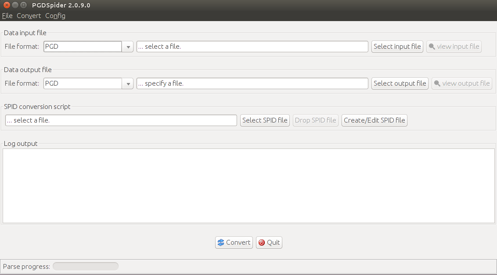

------------
> #### Learning Objectives
------------


#Summary

- [Analyse sex-specific demographic changes in a European population](#section-id-45)
  - [The biological question](#section-id-49)
  - [The software required](#section-id-59)
    - [From raw data to variants](#section-id-64)
    - [Task specific](#section-id-70)
      - [Bayesian Evolutionary Analysis Sampling Trees (BEAST)](#section-id-72)
  - [Project tasks](#section-id-88)
    - [1. Copy the fastq files in your directory](#section-id-96)
    - [2. Process the NGS data](#section-id-106)
    - [3. Prepare input files for BEAST](#section-id-110)
        - [3.1 Convert  in  files](#section-id-117)
        - [3.2 Generate  file (BEAUti)](#section-id-185)
    - [3.4 Run BEAST](#section-id-228)
        - [Submit a job to job scheduler](#section-id-241)
    - [3.5 Run Tracer](#section-id-275)
    - [5. Interpret the output and prepare a report](#section-id-284)
  - [Recap](#section-id-291)
  - [References](#section-id-298)


<div id='section-id-13'/>

<div id='section-id-43'/>

############################################

<div id='section-id-45'/>

# Analyse sex-specific demographic changes in a European population


<div id='section-id-49'/>

## The biological question
We have sequenced the whole mitochondrial genome and 2.2Mb of the Y chromosome in 20 individuals from the CEU population included in the [HapMap](http://hapmap.ncbi.nlm.nih.gov/) project. We want to compare how the male and female [effective population sizes (Ne)](http://www.nature.com/scitable/topicpage/genetic-drift-and-effective-population-size-772523) changed through time and understand the role of sex-biased processes in the evolution of the European population.

We will use a Bayesian method, Bayesian Skyline Plot (BSP), that co-estimates the genealogy, the demographic history (through the Ne) and the substitution-model parameters from aligned sequences. Take some time to read this [review](https://pgl.soe.ucsc.edu/ho11.pdf) about the methods.

Take some time to read about [Bayesian Inference](https://en.wikipedia.org/wiki/Bayesian_inference), and its [application in phylogeny](https://en.wikipedia.org/wiki/Bayesian_inference_in_phylogeny).


<div id='section-id-57'/>

############################################

<div id='section-id-59'/>

## The software required

<div id='section-id-61'/>

############################


<div id='section-id-64'/>

### From raw data to variants

As the course will cover in very detail this part we will skip and talk only about more specific software.
In summary you will have to follow the pipeline we have applied during the practicals.

<div id='section-id-69'/>

############################
<div id='section-id-70'/>

### Task specific

<div id='section-id-72'/>

#### Bayesian Evolutionary Analysis Sampling Trees (BEAST)

[BEAST](http://beast.bio.ed.ac.uk/) is a program for Bayesian analysis of molecular sequences based on the construction of [phylogenetic trees](https://en.wikipedia.org/wiki/Phylogenetic_tree).   BEAST uses [Markov chain Monte Carlo (MCMC)](https://en.wikipedia.org/wiki/Markov_chain_Monte_Carlo) to average over the tree space. This allows to test evolutionary hypothesis by weighing each tree on its posterior probability and avoiding fixing the tree topology.

Take some time to read one of the [BEAST tutorials](http://beast.bio.ed.ac.uk/Tutorials). We recommend you read the *Divergence Dating (Primates) v1.2a.zip (BEAST v1.6.x)*, but any other will be good as well. Download the tutorial and take time to go through the files.

Wwe will use BEAST to produce BSP like this:

>

>This plot represents a Bayesian Skyline Plot of [Eastern Pygmies](https://en.wikipedia.org/wiki/Pygmy_peoples). The y axis represents the female effective population size (Ne) in a log scale and the x axis shows time in thousands of years ago (Kya). The
thicker coloured lines are the median for Ne and the thinner grey lines represent 95% higher posterior density intervals. What you can observe here is a constant effective population size between 140 ad 20 kya   followed by a decline until 4kya  and a subsequent expansion.  


<div id='section-id-86'/>

############################################

<div id='section-id-88'/>

## Project tasks

For this project we will use a graphical interface, therefore remember to ssh using the `-X` (capitalX!) option that will enable the use of the graphical interface

```
ssh -X  user@cluster.it
```

<div id='section-id-96'/>

### 1. Copy the fastq files in your directory

The Fastq files we will use here were extracted from a custom enrichment experiment. Agilent SureSelect was used to capture 26Mb of the human genome, and paired-end libraries were run on a HiSeq 2000 sequencer with 100bp read length (Hallast et al, 2015).

`.fastq` files are in this folder:  `/pico/scratch/userexternal/vcolonna/project_2/fastq`

Copy in your personal data directory the ones you will work with  using the shell  `cp` command

<div id='section-id-104'/>

############################

<div id='section-id-106'/>

### 2. Process the NGS data
You will align the reads to the reference genome, refine the BAM and perform QC, do the variant calling and filtering.


<div id='section-id-110'/>

### 3. Prepare input files for BEAST

BEAST take as **input** a file composed of two parts: demographic parameters and aligned DNA sequences. The BEAST's routine BEAUti is used to generate input files for BEAST. In turn, BEAUti take as input files aligned sequences either in [`.fasta`](https://en.wikipedia.org/wiki/FASTA_format) or [`.nex` NEXUS](http://hydrodictyon.eeb.uconn.edu/eebedia/index.php/Phylogenetics:_NEXUS_Format) file formats.

Take some time to familiarize with the file formats. In our case we will go through the `.fasta`


<div id='section-id-117'/>

#####  3.1 Convert `.vcf` in `.fasta` files

Our first step is to convert the `.vcf` in `fasta`. As usual there are several ways to do this, among which the useful [PDGSpider](http://www.cmpg.unibe.ch/software/PGDSpider/).

You should install PDGSpider on your workspace in few steps. First download the file using the shell command [`wget`](https://www.gnu.org/software/wget/manual/wget.html)


```
 wget http://www.cmpg.unibe.ch/software/PGDSpider/PGDSpider_2.0.9.0.zip

 ```

 The zipped file you just downloaded contains the executable file needed. Unzip the folder using the shell command `unzip`.

```
unzip PGDSpider_2.0.9.0.zip
```

Move to the unzipped folder and list  its content. You will find several files among which PGDSpider2.sh that is the file we want to launch to open the graphical interface.

```
cd PGDSpider_2.0.9.0.zip
ls -l

drwxrwxr-x 3 usr usr    4096 set 25 17:35 ./
drwxrwxr-x 3 usr usr    4096 nov 24 15:04 ../
-rw-rw-r-- 1 usr usr    3436 set 25 17:21 changelog.txt
drwxrwxr-x 2 usr usr    4096 set 25 17:29 examples/
-rw-rw-r-- 1 usr usr    1549 gen 12  2015 LICENSE.txt
-rw-rw-r-- 1 usr usr    5079 giu 20  2009 log4j.dtd
-rw-rw-r-- 1 usr usr   10646 ott 12  2011 PGD_schema.xsd
-rw-rw-r-- 1 usr usr   33792 giu 20  2011 PGDSpider2-cli.exe
-rw-rw-r-- 1 usr usr 9199806 set 25 17:31 PGDSpider2-cli.jar
-rw-rw-r-- 1 usr usr   36864 giu 20  2011 PGDSpider2.exe
-rw-rw-r-- 1 usr usr 9474801 set 25 17:31 PGDSpider2.jar
-rw-rw-r-- 1 usr usr      58 giu 21  2011 PGDSpider2.sh
-rw-rw-r-- 1 usr usr 7525387 set 25 17:23 PGDSpider manual_vers 2-0-9-0.pdf
-rw-rw-r-- 1 usr usr    6946 set 25 17:21 README.txt
-rw-rw-r-- 1 usr usr    9662 ott 30  2008 spider48.ico
-rw-rw-r-- 1 usr usr   18918 lug  7  2011 stylesheet_PGD.xsl

```

To make sure that PGDSpider2.sh is executable let's change its permissions using the unix [`chmod`](https://en.wikipedia.org/wiki/Chmod) command

```
chmod +x PGDSpider2.sh
```

Now we are finally ready to launch the program:

```
./PGDSpider2.sh
```
if all worked, you should see this:




Follow the instruction to upload the `.vcf` and convert it. If all worked, this operation will generate a `.fasta`  file in your work directory

```
ls

-rw-rw-r-- 1 user user        676 19 nov 12:17 myfile.fasta
```


<div id='section-id-185'/>

#####  3.2 Generate `.xml` file (BEAUti)

To generate the input  `.xml` file for BEAST  we will use a routine of BEAST called [BEAUti](http://beast.bio.ed.ac.uk/BEAUti).
We will use the BEAUti graphical interface although we will launch it on the PICO cluster. To launch BEAUti we should first load BEAST, as BEAUti is part of it.

```
module load profile/advanced
module load autoload beast
beauti
```
>**Note** that the  the **module load** instruction apply specifically to this cluster. Other machines might have a different way to launch BEAST/BEAUti

At this time a graphical interface  should appear.


You will go through a number of steps all guided by the interface. BEAUti  does the job of specifying all the demographic model options. Use default ones unless you are familiar with them and you feel you should make changes.

a) Import the FASTA  file

b) Set the [substitution model](https://en.wikipedia.org/wiki/Substitution_model)

c) Set the ‘molecular clock’ model

d) Set the tree prior

e) Set up the priors

f) Set up the operators

g) Set the MCMC options

At the end you should have generated an `.xml` file in your working directory

```
-rw-rw-r-- 1 user user        676 19 nov 12:17 myfile.xml
```
>`.xml`: this is an equivalent of the NEXUS format written in the [Extensible Markup Language (XML)](https://en.wikipedia.org/wiki/XML) style. While the `.xml` file format might seem complicated at first sight, it can be easily read by considering that it is subdivided in blocks containing the sequences and the information for BEAST about (a) the parameters of the demographic model, and (b) the parameters of the MCMC.  

Take some time to explore the `.xml` file and try to understand its structure.


<div id='section-id-228'/>

### 3.4 Run BEAST

We are now ready to run BEAST. The syntax to run BEAST is:

```
beast <options> example.xml
```
We will use the `-working` options to have the output

```
beast -working  myfile.xml
```

<div id='section-id-241'/>

#####  Submit a job to job scheduler  

If we are using a very small file, the command line described above can be very fast with and run interactively. However in reality files are large and we might want to submit jobs instead.

If we are using a machine with a [PBS](https://en.wikipedia.org/wiki/Portable_Batch_System) job scheduler we might want to embed the command line in a PBS script as described in the [instructions](00-beforewestart.md) to run jobs with PBS.

The PBS script will look like:

```
<div id='section-id-250'/>

#!/bin/bash
<div id='section-id-251'/>

#PBS -q workq
<div id='section-id-252'/>

#PBS -N admix2
<div id='section-id-253'/>

#PBS -l nodes=1:ppn=1
<div id='section-id-254'/>

#PBS -o /absolutepath/outerr/runbeast.out
<div id='section-id-255'/>

#PBS -e /absolutepath/outerr/runbeast.err

cd /myworkingdir
module load autoload beast

beast -working  myfile.xml

```
This PBS  will produce two files:

```
ls

-rw-rw-r-- 1 user user     27054 19 nov 14:06 myfile.log
-rw-rw-r-- 1 user user     27054 19 nov 14:06 myfile.trees
```
>- `.log` *This file contains information from the MCMC every n steps, where n is set in BEAUti. The content of the file is described in the header, take some time to explore it.*
>- `.trees` *file (NEXUS format): trees  (either phylogenies or geneologies) sampled  at the same time  during the MCMC*


<div id='section-id-275'/>

### 3.5 Run Tracer


To analyze the results of BEAST we are going to use [Tracer](http://tree.bio.ed.ac.uk/software/tracer/), a program for analysing the trace files generated by Bayesian MCMC runs. It is also distributed with BEAST [here](http://beast.bio.ed.ac.uk/tracer).
Tracer provides summary statistics of the MCMC runs  but it also produces an estimates of the marginal posterior distributions of parameters of our model.

Tracer produces graphical outputs but you can also decide to export Trace output to a file and make your own graphs using R


<div id='section-id-284'/>

### 5. Interpret the output and prepare a report

Here is where we want you to be creative...


<div id='section-id-291'/>

## Recap

To summarize, below a list of all the task-specific software that we need to use. We will run some of them and use only file format from others.


<div id='section-id-298'/>

## References
